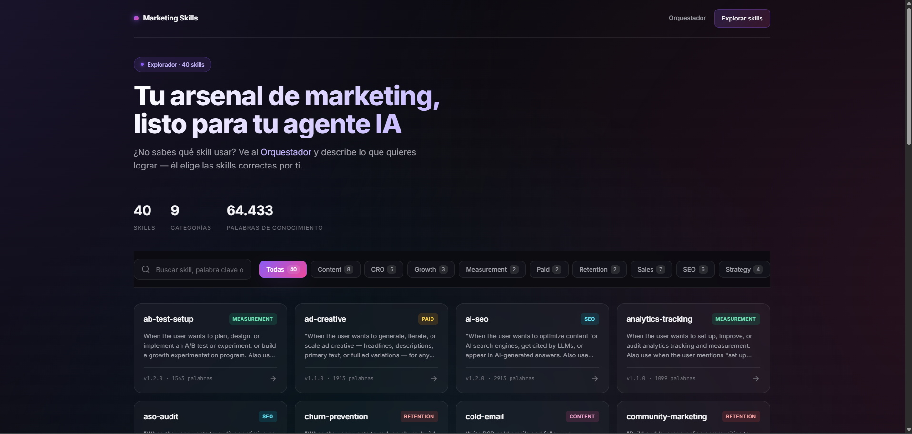
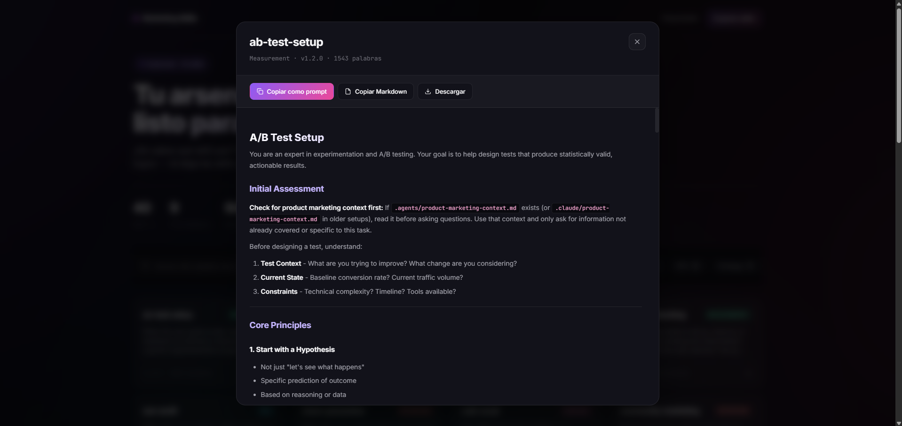
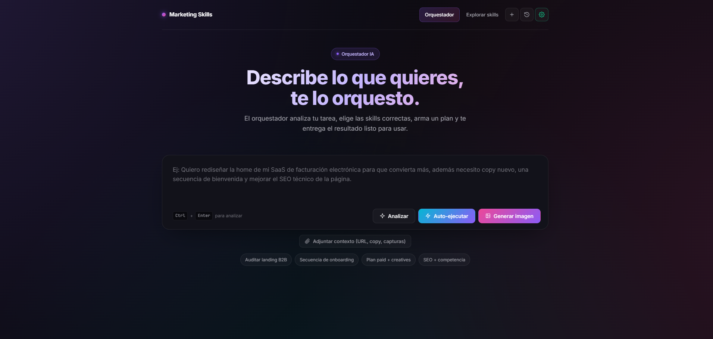
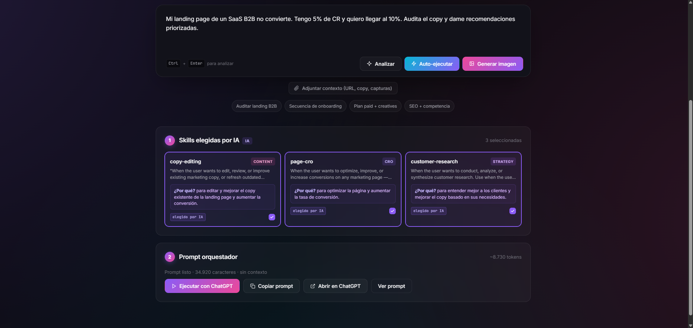
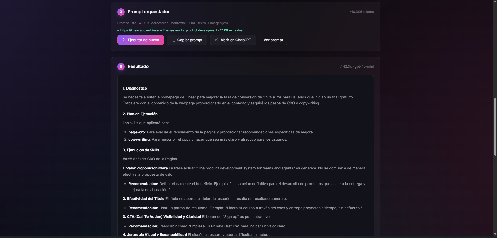

# Marketing Agent

Hub estático en JavaScript que convierte el repositorio [`marketingskills`](marketingskills/) (40 skills de marketing en formato Markdown) en una aplicación visual con dos modos de uso:

1. **Explorador de Skills** ([index.html](index.html)) — busca, filtra por categoría y consulta cualquier skill como prompt listo para pegar en tu IA favorita.
2. **Orquestador** ([orchestrator.html](orchestrator.html)) — describes una tarea de marketing y un LLM (Claude, GPT, DeepSeek, Groq, OpenRouter o cualquier endpoint compatible con OpenAI) selecciona automáticamente las skills correctas, las combina con el contexto que aportes (URL, copy, archivos, capturas) y ejecuta la tarea con streaming en tiempo real. Incluye **generación de imágenes** (OpenAI, Google Imagen) cuando la tarea lo requiere.

> **100% estático.** Sin PHP, sin servidor backend. Sirve la carpeta desde GitHub Pages, Netlify, Vercel, Cloudflare Pages, Laragon, `npx serve`, o cualquier CDN. Las API keys nunca pasan por un servidor intermedio: viven en `localStorage` y van directo del navegador al proveedor.

---

## Capturas

> Las imágenes se cargan desde `docs/screenshots/`.

### 1. Explorador de Skills


### 2. Modal de detalle de una skill


### 3. Orquestador — entrada


### 4. Smart match — selección automática de skills


### 5. Ejecución con streaming


---

## Arquitectura

```
Marketing/
├── index.html                  # Hub explorador
├── orchestrator.html           # Orquestador IA
├── assets/
│   ├── skills-loader.js        # tokenize + scoreSkills + loadSkills
│   ├── md.js                   # parser Markdown ligero
│   ├── providers.js            # tabla de proveedores LLM (Anthropic / OpenAI / DeepSeek / Groq / OpenRouter / custom)
│   ├── image-providers.js      # tabla de proveedores de imagen (OpenAI gpt-image-1 / DALL-E, Google Imagen, custom)
│   ├── url-fetcher.js          # extracción de URLs vía Jina Reader (r.jina.ai)
│   ├── prompt-builder.js       # ensamble del prompt orquestador (variantes con/sin contexto)
│   ├── llm-client.js           # smartMatch + runStream (SSE en el navegador)
│   ├── image-client.js         # generateImage + makeThumbnail (canvas)
│   ├── history.js              # historial localStorage
│   ├── app-explorer.js         # bootstrap de index.html
│   └── app-orchestrator.js     # bootstrap de orchestrator.html
├── data/
│   └── skills.json             # generado por scripts/build-skills.mjs
├── scripts/
│   └── build-skills.mjs        # genera data/skills.json desde marketingskills/skills/
├── .github/workflows/
│   └── deploy-pages.yml        # regenera skills.json y publica a GitHub Pages
├── marketingskills/            # submódulo git con las 40 skills (fuente de verdad)
└── package.json
```

**Flujo del orquestador:**

```
Tarea del usuario
       │
       ▼
  Smart match  ──►  llm-client.smartMatch — el LLM elige 2–5 skills relevantes
                    + razón textual visible en cada card
       │
       ▼
  Contexto    ──►  url-fetcher (Jina Reader) extrae landing como markdown
                    + texto pegado + archivos (.txt/.md/.csv/.json/...) + imágenes base64
                    + paste directo de capturas desde el portapapeles (Ctrl+V)
       │
       ▼
  Build prompt ──►  prompt-builder.buildPrompt — rol "Marketing Orchestrator"
                    con dos variantes (ROLE_WITH_CONTEXT / ROLE_NO_CONTEXT) +
                    cuerpo de cada skill + contexto + tarea
       │
       ▼
  Run (SSE)   ──►  llm-client.runStream — fetch directo al provider, parseo SSE en
                   el browser (Anthropic content_block_delta | OpenAI delta.content)
       │
       ▼
  Imágenes    ──►  image-client.generateImage — DALL-E 3, gpt-image-1 o Imagen
       │           con thumbnails canvas
       ▼
  Historial   ──►  history.js — guarda tarea, skills, prompt y resultado en
                    localStorage (drawer lateral, hasta 30 entradas)
```

---

## Características

### Skills y descubrimiento
- **40 skills** indexadas y categorizadas automáticamente (mapeo `slug → categoría` en [scripts/build-skills.mjs](scripts/build-skills.mjs)).
- **Buscador** con tokenización en español + inglés y stopwords filtrados ([assets/skills-loader.js](assets/skills-loader.js)).
- **Smart match** con LLM como router: elige entre 2 y 5 skills relevantes y muestra una **razón textual** por cada elección. Fallback automático a matching por keywords si el LLM falla.

### Proveedores de IA
- **Multi-proveedor para texto:** Anthropic, OpenAI, DeepSeek, Groq, OpenRouter y cualquier endpoint *OpenAI-compatible* (Ollama, LM Studio, vLLM, etc.) vía la opción `Custom`.
- **Multi-proveedor para imágenes:** OpenAI (`gpt-image-1`, `dall-e-3`, `dall-e-2`), Google Imagen (`imagen-3.0-generate-002`, `imagen-4.0-generate-preview`) y endpoints custom compatibles con OpenAI Images.
- **API key por proveedor**: cada key se guarda en su propio slot, así puedes alternar sin perderlas.
- **Streaming nativo** vía Server-Sent Events parseados en el navegador con `ReadableStream` y cursor parpadeante mientras llega el output.

### Contexto y multimodalidad
- **Visión multimodal:** sube capturas y se envían como `image/base64` (Anthropic) o `image_url` (OpenAI-compatible).
- **Paste directo de capturas** desde el portapapeles con `Ctrl+V` en el textarea principal.
- **Extracción de páginas web vía [Jina Reader](https://r.jina.ai/)**: gratis, sin auth, devuelve markdown limpio. Si falla, basta con pegar el contenido manualmente en el campo de texto.
- **Adjuntos de archivos**: `.txt`, `.md`, `.csv`, `.json`, `.html`, `.log`, `.xml` hasta 60 KB; imágenes hasta 5 MB; máximo 6 archivos.
- **Generación de imágenes integrada**: pide visuales de campañas, banners o capturas de mock-ups directamente en el flujo. Thumbnails generados en canvas para previsualización inline.

### Productividad
- **Auto-ejecutar**: en un solo click hace smart match → ensamble del prompt → streaming de la respuesta.
- **Historial** lateral con las últimas 30 consultas (tarea, skills, prompt, resultado, modelo, timestamp). Click sobre una entrada para restaurarla y re-ejecutar.
- **Nueva consulta** (`Ctrl+K`): limpia tarea, contexto, adjuntos, skills y resultado, y aborta cualquier streaming en curso.
- **Regla anti-alucinación:** el orquestador tiene dos variantes de prompt según haya o no contexto. Si la tarea menciona un asset concreto (landing, email, anuncio…) y no se aportó material real, devuelve solo una pregunta pidiendo el material en lugar de inventar ejemplos genéricos.

### Privacidad
- **API keys nunca tocan un servidor:** se guardan en `localStorage` del navegador y se envían directo al provider en cada request.
- **Sin telemetría**, sin tracking, sin dependencias en runtime salvo el provider que tú elijas.

---

## Requisitos

- Node.js ≥ 20 (solo para `scripts/build-skills.mjs`; en runtime no se necesita Node).
- Git con soporte de submódulos.
- API key de al menos un proveedor de IA si vas a usar el orquestador.

## Instalación

```bash
git clone --recurse-submodules <url-del-repo> Marketing
cd Marketing
```

Si ya clonaste sin `--recurse-submodules`:

```bash
git submodule update --init --recursive
```

Genera el catálogo y arranca un servidor estático:

```bash
node scripts/build-skills.mjs   # crea data/skills.json (40 skills)
npm run dev                     # levanta http://localhost:3000 con `npx serve`
```

Alternativas para servir:

```bash
python3 -m http.server 8000     # http://localhost:8000/
php -S localhost:8000            # también funciona, ya no necesita PHP en runtime
```

O simplemente coloca la carpeta en Laragon/XAMPP y abre `http://localhost/Marketing/`.

## Despliegue en GitHub Pages

1. Habilita Pages en Settings → Pages → Source: **GitHub Actions**.
2. Push a `main`. El workflow [.github/workflows/deploy-pages.yml](.github/workflows/deploy-pages.yml) hace checkout con submódulos, regenera `data/skills.json`, y publica todo el sitio.
3. La URL queda en `https://<usuario>.github.io/<repo>/`.

> El workflow regenera `skills.json` en cada deploy, así que no hace falta commitearlo (está en [.gitignore](.gitignore)). Si quieres versionarlo de todos modos, quita la línea `data/skills.json` del gitignore.

## Uso

### Explorador
1. Abre `index.html`.
2. Filtra por categoría o busca por palabra clave.
3. Clic en una card → leer la skill → **Copiar como prompt** → pegar en Claude/ChatGPT/etc.

### Orquestador
1. Abre `orchestrator.html` y haz clic en el ícono de llave para configurar proveedor, modelo y API key (puedes guardar varias keys de distintos proveedores).
2. Describe tu tarea (ej.: *"audita el copy de mi landing https://miapp.com y reescribe la sección hero"*).
3. (Opcional) Aporta contexto en el panel "Adjuntar contexto":
   - **URL**: se extrae con Jina Reader (markdown limpio, hasta 25 KB).
   - **Texto / copy**: pegado directo.
   - **Archivos**: `.txt`, `.md`, `.csv`, `.json`, `.html`, `.log`, `.xml` hasta 60 KB.
   - **Imágenes**: hasta 5 MB cada una, máximo 6 archivos. También puedes pegar capturas con `Ctrl+V` directo en la tarea.
4. Pulsa **Smart match** para que el LLM elija las skills (verás la razón de cada elección), o **Auto-ejecutar** para hacer todo en un click.
5. La respuesta se transmite en directo en el panel de salida.
6. (Opcional) Si la tarea pide visuales, activa la **generación de imágenes**, elige modelo (DALL-E 3, gpt-image-1, Imagen) y tamaño/calidad.
7. Cada ejecución se guarda en el **historial** (icono de reloj en la barra superior) — clic para restaurar y re-ejecutar.
8. **`Ctrl+K`** en cualquier momento para empezar una consulta nueva (limpia todo, aborta streaming en curso).

---

## Notas de despliegue y CORS

- **Anthropic** requiere el header `anthropic-dangerous-direct-browser-access: true`, que ya manda [assets/providers.js](assets/providers.js).
- **OpenAI / DeepSeek / Groq / OpenRouter** soportan llamadas browser-direct con `Authorization: Bearer ...`.
- **Endpoint custom (Ollama, LM Studio, vLLM)**: tu servidor local debe permitir CORS. En Ollama: `OLLAMA_ORIGINS="*" ollama serve`.
- **Jina Reader** (`https://r.jina.ai/`) tiene rate limit razonable sin API key (~20 RPM). Si te bloquea, pega el contenido en el campo de texto.
- **Generación de imágenes**: las APIs de imagen (OpenAI Images, Google Imagen) responden con `b64_json` o `bytesBase64Encoded`, así que las imágenes nunca se descargan desde una URL temporal — se renderizan inline desde el base64.

---

## Atajos de teclado

| Atajo | Acción |
|---|---|
| `Ctrl + Enter` | Analizar tarea (en el textarea principal) |
| `Ctrl + V` | Pegar captura desde el portapapeles directamente como adjunto |
| `Ctrl + K` | Nueva consulta (limpia todo, aborta streaming) |
| `Esc` | Cerrar modales / drawer del historial |

---

## Modelos compatibles con visión

No todos los modelos "ven" imágenes. Si subes una captura y eliges un modelo solo-texto, la API devolverá error.

| Proveedor | Modelos con visión |
|---|---|
| **Anthropic** | Todos los Claude Sonnet/Opus/Haiku 3.x y 4.x |
| **OpenAI** | gpt-4o, gpt-4o-mini, gpt-4.1, gpt-5, o1 (`o3-mini` **no** ve imágenes) |
| **DeepSeek** | deepseek-chat es solo texto |
| **Groq** | Solo `llama-3.2-90b-vision-preview` y similares |
| **OpenRouter** | Depende del modelo destino |

Para auditar landings con captura, recomendados: **Claude Sonnet 4.5** o **GPT-4o**.

---

## Changelog

### v3 — Generación de imágenes y prompt context-aware
- Nuevo módulo de imágenes (OpenAI gpt-image-1, DALL-E 2/3, Google Imagen) con thumbnails canvas.
- Prompt orquestador con dos variantes (`ROLE_WITH_CONTEXT` / `ROLE_NO_CONTEXT`) para no pedir material redundantemente.
- Documentación con screenshots en `docs/screenshots/`.

### v2 — Migración a JS estático
- Reescritura completa del backend PHP a JavaScript en el navegador.
- Workflow de GitHub Pages que regenera `data/skills.json` desde el submódulo en cada deploy.
- API keys 100% client-side, nunca pasan por un servidor.

### v1 — Orquestador multi-proveedor (PHP)
- Soporte multi-proveedor con streaming SSE.
- Smart match con LLM como router.
- Panel de contexto, fetch server-side de URLs, historial localStorage.
- Auto-ejecutar, atajo `Ctrl+K` para limpiar, paste de imágenes desde portapapeles.

---

## Créditos

- Skills originales: [`coreyhaines31/marketingskills`](marketingskills/) por Corey Haines.
- Hub estático, orquestador, smart match y vista UI: este repositorio.
